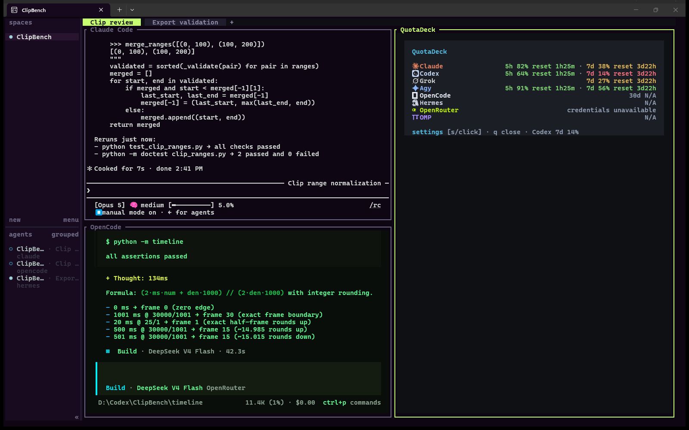
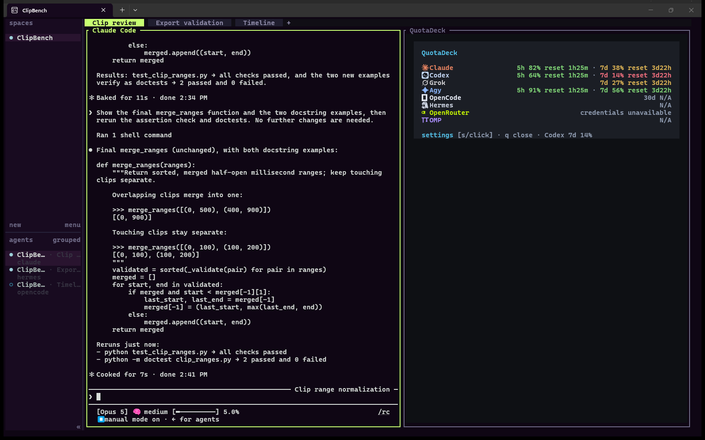
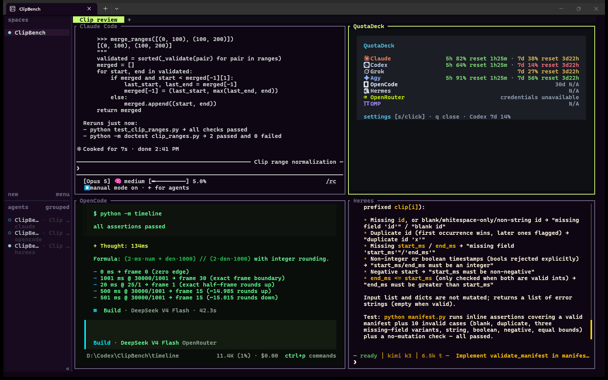
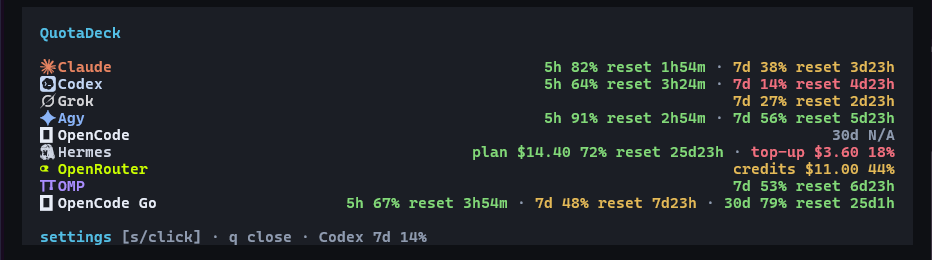
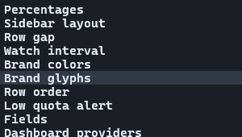
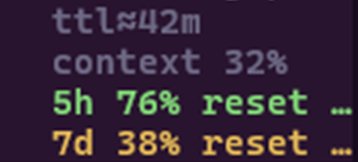
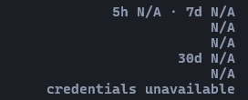

<div align="center">

# QuotaDeck

### Know what you have left.

Live quota, model, context and cache data.<br>
One resizable pane, beside your work in Herdr.

**[Website](https://artmoreno.github.io/herdr-agent-quota-win/) · [Install](#install) · [Settings](#settings) · [中文](README.zh-CN.md)**

[](https://github.com/ArtMoreno/herdr-agent-quota-win/actions/workflows/ci.yml)
[](LICENSE)
[](https://herdr.dev)

 &nbsp;  &nbsp;  &nbsp;  &nbsp;  &nbsp;  &nbsp;  &nbsp; 

</div>

<p align="center"><a href="https://artmoreno.github.io/herdr-agent-quota-win/"></a></p>

<p align="center"><sub>Real Claude Code and OpenCode sessions in a fictional ClipBench project. QuotaDeck values are illustrative.</sub></p>

| Beside your work | Make it yours | Honest by default |
| --- | --- | --- |
| A real, resizable Herdr pane. | Provider order, colors, fields and sidebar layout. | Missing credentials and unknown resets stay explicit. |
| Open with **prefix+shift+d**. | Open Settings with **prefix+shift+q** or **s**. | Uses the accounts available to your local tools. |

<details>
<summary><b>See two- and four-pane workspaces</b></summary>

**Two panes — Claude Code + QuotaDeck**



**Four panes — Claude Code + OpenCode + Hermes + QuotaDeck**



Real harness sessions on fictional example code; illustrative quota data.

</details>

## At a glance



<sub>Illustrative capture. OpenRouter appears only in the dashboard; dollar-based rows remain dollar-based.</sub>

| Settings within reach | Packed or stacked sidebar | Explicit unavailable states |
| :---: | :---: | :---: |
|  |  |  |

---

## Install

Requires Herdr 0.8.2+, Git, Rust 1.95+, Windows, macOS or Linux, and at least
one supported agent CLI.

Use your existing signed-in agent accounts; QuotaDeck has no separate login.
Run installation in a normal terminal attached to the Herdr session you use.
The first build can take several minutes and needs the platform's Rust linker
(MSVC C++ Build Tools on Windows). Subsequent repairs reuse that build.
Before updating a Windows checkout, close its QuotaDeck dashboard and Settings
panes so Windows can replace the executable. Your agent panes can stay open.

```sh
herdr plugin install ArtMoreno/herdr-agent-quota-win
herdr plugin action invoke configure --plugin herdr-agent-quota-win
```

The first command builds and registers the plugin. The second installs its
reversible collectors and sidebar rows. Claude quota and reset windows load
directly from the signed-in Claude Code account; its statusLine remains the
fallback and supplies per-session diagnostics. Before restarting existing agent
panes, confirm the latest entry reports `"status":"succeeded"`:

```sh
herdr plugin log list --plugin herdr-agent-quota-win --limit 5
```

To work from a local checkout instead:

```sh
git clone https://github.com/ArtMoreno/herdr-agent-quota-win.git
cd herdr-agent-quota-win
./install.sh                  # macOS, Linux
```

```powershell
.\install.ps1                 # Windows
```

Restart already-running agent panes once. To install only a subset:

```sh
./install.sh --agent claude,codex,hermes
```

```powershell
.\install.ps1 -Agent claude,codex,hermes
```

Supported values: `all`, `claude`, `codex`, `grok`, `agy`, `opencode`, `pi`,
`omp`, `hermes`.

## Dashboard

Press `prefix+shift+d` to open QuotaDeck as a real resizable split. You can
also open either dashboard form directly:

```sh
herdr plugin action invoke open-dashboard --plugin herdr-agent-quota-win
herdr plugin action invoke open-dashboard-split --plugin herdr-agent-quota-win
```

Use the shortcut for an immediate pane with no command-output overlay. The CLI
commands return Herdr's JSON action receipt; that receipt is not the dashboard.
For a named session outside Herdr, put `--session <name>` immediately after
`herdr` in these commands.

The split reflows as the pane changes size. It uses the terminal's alternate
screen, so resize frames do not accumulate in scrollback. When the provider list
is taller than the pane, scroll the current list with the mouse wheel,
Up/Down, PageUp/PageDown, Home, or End. Press `r` to refresh or `q`/Escape to
close.

## Settings

Press `prefix+shift+q`, click **settings** in the dashboard footer, press `s`
while the dashboard is focused, or run:

```sh
herdr plugin action invoke open-settings --plugin herdr-agent-quota-win
```

Herdr 0.8 does not expose extension points for its built-in Settings tabs or
bottom-right menu. The plugin therefore opens its own managed popup. A key
conflict is preserved rather than overwritten; use the command above instead.

| Control | Values | Effect |
| --- | --- | --- |
| Percentages | `remaining`, `used` | Changes the number; colors still mean remaining headroom. |
| Sidebar layout | `packed`, `stacked` | Joins related fields or gives each field a row. |
| Row gap | `0`, `1` | Controls spacing between Agent cards. |
| Watch interval | 30s–1h | Polls Claude, Codex, Grok, Agy, and Hermes while those harnesses work; dashboard-local rows refresh while the dashboard is open. Pi/OMP refresh on their own events and focus. |
| Brand colors | `on`, `off` | Colors provider/model names; severity colors remain. |
| Row order | `manual`, `least left` | Uses the saved dashboard order, or puts the lowest visible remaining quota first in both the dashboard and Herdr agent sidebar. |
| Low quota alert | `off`, 5–50% | Notifies once when a provider crosses the threshold. |
| Brand glyphs | `icon`, `unicode`, `off` | Draws each provider's logo beside its name. See [Brand marks](#brand-marks). |
| Fields | topic, model, cache, TTL, context, short/long quota | Hides optional dimensions. Topic is off by default because it is prompt-derived. |
| Dashboard providers | show/hide, order, `#RRGGBB`, provider-specific fields | Controls dashboard rows. Plugin-managed sidebar rows reuse matching colors; Pi inherits Codex and OpenCode inherits OpenCode Go. User-owned rows are never recolored. |
| Agents | eight supported harnesses | Installs or removes collectors and sidebar rows. |

Use `↑/↓` to move, `←/→` or Space to change, `a` to apply, and `q` to close.
A `*` means there are unapplied changes. Inside Dashboard providers, use `u`/`d`
to reorder, `c` to edit the exact color, and Enter to choose that provider's fields.

The same settings are scriptable:

```sh
./install.sh \
  --agent all \
  --sidebar-layout packed \
  --row-gap 1 \
  --quota-percent remaining \
  --fields all \
  --brand-colors on \
  --brand-glyphs icon \
  --agent-order quota \
  --low-quota-alert 10 \
  --watch-interval-seconds 60
```

Manual refresh and local-checkout uninstall:

```sh
herdr plugin action invoke refresh --plugin herdr-agent-quota-win
./uninstall.sh
```

```powershell
.\uninstall.ps1
```

For a GitHub-managed install, restore plugin-owned configuration first. Wait
for the latest log entry to report `"status":"succeeded"` before uninstalling
the registered plugin:

```sh
herdr plugin action invoke uninstall --plugin herdr-agent-quota-win
herdr plugin log list --plugin herdr-agent-quota-win --limit 5
```

Only after that entry succeeds:

```sh
herdr plugin uninstall herdr-agent-quota-win
```

## Hermes and OpenRouter

Both report **dollars**, not a renewing percentage window, so they are shaped
differently from the subscription collectors.

**Hermes** reads the Nous Portal account its own `/usage` surface reads, using
the token Hermes already stored — so the two can never disagree. Plan dollars
and purchased top-up dollars are separate rows because they behave differently:
plan renews at the period end, top-up rolls over and never resets. Blending them
would make a full top-up balance read as a fresh month.

A top-up percentage appears only when Portal supplies a real positive
`total_usable_credits` denominator. If it does not, the plugin keeps the valid
plan row and omits the unverifiable percentage instead of drawing a healthy
`100%` value.

**OpenRouter** is the one collector with no harness: it is an account other
harnesses spend from, never a pane of its own. It is refreshed globally and
appears in the dashboard rather than owning a sidebar row. It prefers the
per-key spend limit from `/auth/key` over the account balance whenever the key
has one, since that is the number that runs out first.

Hermes plan dollars show their real renewal ETA. Top-up dollars and OpenRouter
balances do not reset, so neither gets an invented ETA.

Give OpenRouter a key in whichever way suits you:

```powershell
.\install.ps1 -OpenRouterKey sk-or-v1-...
```

or set `OPENROUTER_API_KEY`, or write the key to
`<herdr plugin config-dir herdr-agent-quota-win>/openrouter-key`. If neither is
set, the collector reads `OPENROUTER_API_KEY` from the active Hermes home's
`.env`, so an existing Hermes setup works without copying the secret.

Passing `-OpenRouterKey` explicitly stores that key in QuotaDeck's per-user
plugin config directory. A full QuotaDeck uninstall removes it; partial agent
removal does not. Environment and Hermes `.env` keys are never copied.

## Refresh health

QuotaDeck 1.4.1 fixes Codex refresh for Windows npm installs. Update existing
installs with `herdr plugin install ArtMoreno/herdr-agent-quota-win`, run the
configure action, and reopen your QuotaDeck pane.

If a request fails, the dashboard shows `refresh failed; check connection`.
An expired or rejected login shows `sign in again`; missing credentials or a
missing CLI have their own messages. Old cached values are hidden while these
messages are shown. Without a successful update for two polling intervals
(minimum two minutes), the row shows its last-update age as stale. Sign into
the affected harness/provider normally, then press `r` to retry. QuotaDeck does
not renew or change your provider credentials.

## Brand marks

Herdr's sidebar is a grid of text cells, so a sidebar logo is a **font glyph**,
never an image. Three sets:

| Setting | What it draws | Needs |
| --- | --- | --- |
| `icon` (default) | Real brand logos | The `Herdr Agent Icons Max` font, which ships with [qintmb/herdr-icon-agent-ui](https://github.com/qintmb/herdr-icon-agent-ui) |
| `unicode` | Mnemonic marks that render in any monospace font | Nothing |
| `off` | Names alone, as upstream | Nothing |

If you have not installed the icon font, select `unicode` in QuotaDeck Settings
(`prefix+shift+q`) or run the local installer with `-BrandGlyphs unicode` on
Windows / `--brand-glyphs unicode` on macOS or Linux. No font install is needed
for quota collection or the dashboard to work.

Choose `off` if you already run a plugin that marks agent rows: that one marks
the *agent*, this one marks the *billing provider*, so together they put two
marks on one row.

Each mark under [`docs/icons/`](docs/icons) ships as SVG and transparent 64px
PNG for documentation and image-capable surfaces; nothing in the sidebar reads
them.

## What is displayed

| Dimension | Source and behavior |
| --- | --- |
| Provider / model | Exact route and active model for the pane's session. |
| Topic | Opt-in current visible user prompt. When enabled, the last topic is local Herdr metadata with the same 24-hour TTL as the quota tokens. |
| Context | Used percentage of the active model's context window. |
| Cache | Session cache hit rate when the agent exposes trustworthy counters. |
| Cache TTL | Recorded expiry when available; `ttl≈` marks a documented estimate. |
| Quota | Remaining or used percentage plus reset ETA, scoped to the serving account. |
| Headroom | Tightest visible quota, used by optional sorting and notifications. |

| Agent | Quota support | Session diagnostics |
| --- | --- | --- |
| Claude Code | 5h + 7d | model, context, cache, recorded prompt-cache expiry |
| OpenAI Codex | 5h + 7d | model, context, cache, estimated 30m cache TTL |
| Grok CLI | 7d or 30d | model, context, cache |
| Agy / Antigravity | 5h + 7d | statusLine model, context, cache |
| OpenCode | Local 30d tokens and recorded spend; OpenCode Go quota when subscribed | exact local session model/context |
| Pi | Canonical Codex quota on an exact account match | model, context, cache, supported TTL data |
| omp (oh-my-pi) | OMP-normalized windows such as `5h`, `1d`, `7d`, `Monthly` | model, context, cache, supported TTL data |
| Hermes | Nous Portal dollars: `plan` (renews) and verifiable `top-up` (rolls over) | model, context, cache |
| OpenRouter | Credit balance, or the per-key spend limit when the key has one | dashboard only — see below |

OMP is a generic adapter, not a second set of provider adapters. The plugin runs
`omp usage --json --provider <id>`, retains OMP's window labels, and attributes
the result with the session's `credential_pin`. It never opens OMP's credential
database or reinterprets Google, Anthropic, or OpenAI periods. OMP's five-minute
usage cache remains authoritative; this plugin adds a one-minute process debounce.

The dashboard's OpenCode row matches `opencode stats --days 30`: it reads token
and cost fields from OpenCode's local database, read-only, and labels dollars as
spent rather than credits remaining. OpenCode Go remains a separate quota row
because ordinary OpenCode, Zen, OpenRouter, and OpenAI sessions do not share a
subscription limit. When OpenCode's stored `opencode-go` key is available, the
dashboard refreshes that quota directly; no Go chat turn is required first. The
local total is read on open, at the configured watch interval while the dashboard
remains open, and immediately when `r` refreshes it.
OpenCode Go is hidden by default; enable it under Dashboard providers when that
separate subscription is in use.

The sidebar has short and long quota rows. OMP's common windows occupy those rows
while retaining their labels; one normalized window is shown per row.

## Herdr integrations

Herdr must report the exact session before local model, context, and account data
can be attributed:

```sh
herdr integration status
```

Enabling OMP automatically installs `herdr integration omp` when it is missing.
Restart an already-running OMP pane afterward because integrations load at agent
startup. Other missing integrations can be repaired directly:

```sh
herdr integration install opencode
herdr integration install pi
herdr integration install omp
```

## Troubleshooting

| Symptom | Check |
| --- | --- |
| OpenCode, Pi, or OMP is blank | Run `herdr integration status`, install the missing integration, then restart that pane. |
| Dashboard OpenCode usage is `N/A` | Confirm OpenCode has completed a local assistant turn in the last 30 days and its data directory is readable. |
| OMP has model/context but no quota | Run `omp usage --json --redact --provider <id>` and confirm a report exists. |
| Herdr cannot execute OMP | Put `omp` on the server's `PATH`, or set `HERDR_AGENT_QUOTA_OMP_BIN`. |
| Claude shows `N/A` | Confirm Claude Code is signed in; QuotaDeck reads its local OAuth credential and falls back to a fresh statusLine snapshot. |
| Agy shows `N/A` | Send one turn so its statusLine emits a snapshot. |
| Rows do not appear | Run `herdr plugin action invoke configure --plugin herdr-agent-quota-win`, then restart affected panes. |
| A value survives a provider outage | Expected: the same account's last good snapshot is retained. |
| Packed rows are truncated | Switch to `stacked`; Herdr does not wrap sidebar tokens. |

## Safety

- No prompt or model request is generated.
- With Topic off by default, events do not read pane text. When Topic is enabled,
  each event reads only its named pane with `--source visible`; refresh and watch
  never read panes.
- Credentials are read only to authenticate their owning provider request and
  never written to cache or logs. Only `install.ps1 -OpenRouterKey` copies the
  explicitly supplied key into the per-user plugin config, and full uninstall
  removes it.
- Persistent snapshots omit prompt text, session summaries, and full provider
  payloads; account and session attribution uses domain-separated SHA-256 tags.
- Topic is off by default. Enabling it publishes a truncated visible prompt only
  to local Herdr metadata, where it has a 24-hour TTL and can be disabled again.
- Exact statusLine restoration keeps one full backup beside the protected source
  settings file; plugin state stores only the reversible statusLine fragment and
  an installed-file digest.
- OMP's `agent.db` is never opened; quota comes only from OMP CLI output.
- Metadata is written only when a token changes and remains within Herdr's 16-token limit.

## Development

```sh
cargo fmt --all -- --check
cargo test --all-targets --all-features --locked
cargo clippy --all-targets --all-features --locked -- -D warnings
cargo build --release --locked
```

See [CONTRIBUTING.md](CONTRIBUTING.md), [SECURITY.md](SECURITY.md), and
[CHANGELOG.md](CHANGELOG.md).

## License

MIT. Not affiliated with Herdr, OpenAI, Anthropic, xAI, Google, or OpenCode.


---

## Credits

**Created and maintained by [Art Moreno](https://github.com/ArtMoreno).**

QuotaDeck builds on [levi-qiao/herdr-agent-quota](https://github.com/levi-qiao/herdr-agent-quota),
MIT © 2026 Levi Qiao. The plugin ID remains `herdr-agent-quota-win` for compatible upgrades.
See [LICENSE](LICENSE) and [third-party notices](THIRD-PARTY-NOTICES.md).
